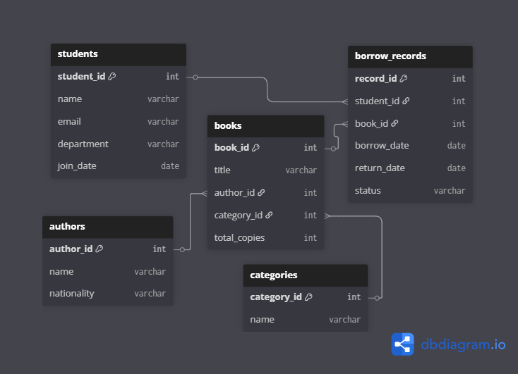

# 📚 BookNest – Library Management System (MySQL)

A relational database project designed to simulate a real-world library system using **MySQL**, covering database schema design, data insertion, and analytical SQL queries.

---

## 🎯 Project Goals
- Design a normalized relational database for library management
- Practice SQL concepts: DDL, DML, constraints, JOINs, aggregates, subqueries
- Showcase data analysis with real-world SQL problems

---

## 🗂️ Project Structure

```bash

BookNest/
├── schema.sql             # CREATE TABLE statements
├── insert_data.sql        # Sample data for all tables
├── queries/               # Folder for categorized query files
│   ├── easy.sql           # 5 easy queries
│   ├── intermediate.sql   # 5 intermediate queries
│   ├── hard.sql           # 5 advanced queries
├── schema.png             # ER diagram image
└── README.md              # Project documentation

```

---

## 🛠️ Tech Stack
- **Database**: MySQL
- **Tools**: MySQL Workbench / CLI
- **Diagram**: dbdiagram.io / drawSQL

---

## 🧩 Database Schema

### Entities:
- `students`
- `authors`
- `categories`
- `books`
- `borrow_records`

### ER Diagram:


---

## 📄 Schema Overview

### `students`
| Column      | Type         | Constraints         |
|-------------|--------------|---------------------|
| student_id  | INT          | PRIMARY KEY         |
| name        | VARCHAR(100) | NOT NULL            |
| email       | VARCHAR(100) | UNIQUE, NOT NULL    |
| department  | VARCHAR(50)  |                     |
| join_date   | DATE         |                     |

### `authors`
| Column      | Type         | Constraints         |
|-------------|--------------|---------------------|
| author_id   | INT          | PRIMARY KEY         |
| name        | VARCHAR(100) | NOT NULL            |
| nationality | VARCHAR(50)  |                     |

### `categories`
| Column      | Type         | Constraints         |
|-------------|--------------|---------------------|
| category_id | INT          | PRIMARY KEY         |
| name        | VARCHAR(50)  | UNIQUE, NOT NULL    |

### `books`
| Column       | Type         | Constraints                     |
|--------------|--------------|---------------------------------|
| book_id      | INT          | PRIMARY KEY                     |
| title        | VARCHAR(150) | NOT NULL                        |
| author_id    | INT          | FOREIGN KEY → authors           |
| category_id  | INT          | FOREIGN KEY → categories        |
| total_copies | INT          | CHECK (total_copies ≥ 0)        |

### `borrow_records`
| Column       | Type         | Constraints                     |
|--------------|--------------|---------------------------------|
| record_id    | INT          | PRIMARY KEY                     |
| student_id   | INT          | FOREIGN KEY → students          |
| book_id      | INT          | FOREIGN KEY → books             |
| borrow_date  | DATE         | NOT NULL                        |
| return_date  | DATE         |                                 |
| status       | VARCHAR(20)  | CHECK ('borrowed', 'returned', 'lost') |

---

## 🧪 Sample Data
- ✔️ 20 students
- ✔️ 20 authors
- ✔️ 20 categories
- ✔️ 20 books
- ✔️ 20 borrow records

---

## 📊 SQL Queries

### 🟢 Easy Queries
- List all students alphabetically
- Show all book titles and copies
- Indian authors only
- All categories
- Basic borrow log with names

### 🟡 Intermediate Queries
- Count books borrowed per student
- List currently borrowed books
- Book count per category
- Students borrowing more than once
- Books by a specific author

### 🔴 Hard Queries
- Top 3 most borrowed books
- Available copies = total - borrowed
- Students who borrowed in June & July
- Books never borrowed
- Student(s) who borrowed the most books

---

## 📌 Highlights
- ✅ Clean ER diagram and schema
- ✅ Proper constraints: PK, FK, CHECK, UNIQUE
- ✅ Data analysis with multi-level SQL queries
- ✅ Beginner to advanced SQL examples

---

## 🙌 Author
**Bala Praharsha Mannepalli**  
📧 balapraharsha.m@gmail.com  
💼 [LinkedIn](https://www.linkedin.com/in/mannepalli-bala-praharsha)  
🌐 [GitHub](https://github.com/balapraharsha)

---

Built as part of personal productivity & AI/ML learning journey.
Feel free to ⭐ the repo if you found it helpful!
